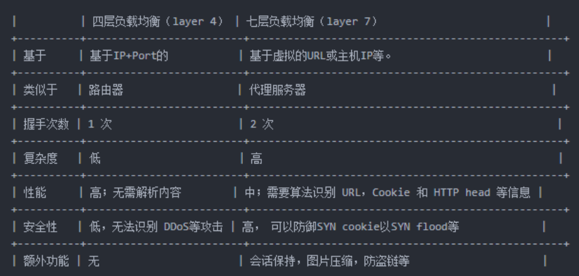

1）四层的负载均衡就是基于IP+端口的负载均衡：在三层负载均衡的基础上，通过发布三层的IP地址（VIP），然后加四层的端口号，来决定哪些流量需要做负载均衡，对需要处理的流量进行NAT处理，转发至后台服务器，并记录下这个TCP或者UDP的流量是由哪台服务器处理的，后续这个连接的所有流量都同样转发到同一台服务器处理。

对应的负载均衡器称为四层交换机（L4 switch），主要分析IP层及TCP/UDP层，实现四层负载均衡。此种负载均衡器不理解应用协议（如HTTP/FTP/MySQL等等）。

实现四层负载均衡的软件有：
F5：硬件负载均衡器，功能很好，但是成本很高。
lvs：重量级的四层负载软件
nginx：轻量级的四层负载软件，带缓存功能，正则表达式较灵活
haproxy：模拟四层转发，较灵活

2）七层的负载均衡就是基于虚拟的URL或主机IP的负载均衡：在四层负载均衡的基础上（没有四层是绝对不可能有七层的），再考虑应用层的特征，比如同一个Web服务器的负载均衡，除了根据VIP加80端口辨别是否需要处理的流量，还可根据七层的URL、浏览器类别、语言来决定是否要进行负载均衡。举个例子，如果你的Web服务器分成两组，一组是中文语言的，一组是英文语言的，那么七层负载均衡就可以当用户来访问你的域名时，自动辨别用户语言，然后选择对应的语言服务器组进行负载均衡处理。

对应的负载均衡器称为七层交换机（L7 switch），除了支持四层负载均衡以外，还有分析应用层的信息，如HTTP协议URI或Cookie信息，实现七层负载均衡。此种负载均衡器能理解应用协议。

## 实现七层负载均衡的软件有：

haproxy：天生负载均衡技能，全面支持七层代理，会话保持，标记，路径转移；

nginx：只在http协议和mail协议上功能比较好，性能与haproxy差不多；

apache：功能较差

Mysql proxy：功能尚可。

### 下图粗略的列举了layer4和layer7的一些区别
